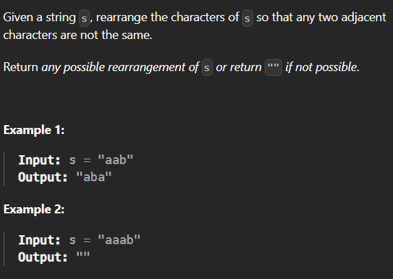

**Approach**

1. First we talk about the checks to know when the problem is impossible: If the most frequently occuring character has a frequency higher than the length of the string + 1 // 2 then it is impossible and we return ""
2. Our general approach is to take the most frequent character and fill in the odd indices of the original string. Then take the 2nd most frequent character and fill in the odd indices assuming there are enough letters for that scenario. If there aren't we will just fill the next even index with the 2nd most frequent character and so on.
3. In this way we reorganize the string to ensure there are no duplicate character subsequences.

4. First we use the Counter to count the frequencies of all the letters
5. Then we do our check for if its possible to rearrange the string as required
6. If so then we proceed and start placing the letters in our list "reorganized" in the specified indicies
7. Return the joined list

Time: O(nlogn) n for the Counter and nlogn is for the most_common function which sorts by frequencies.

Space: O(n) We create a new list for our reorganized string
