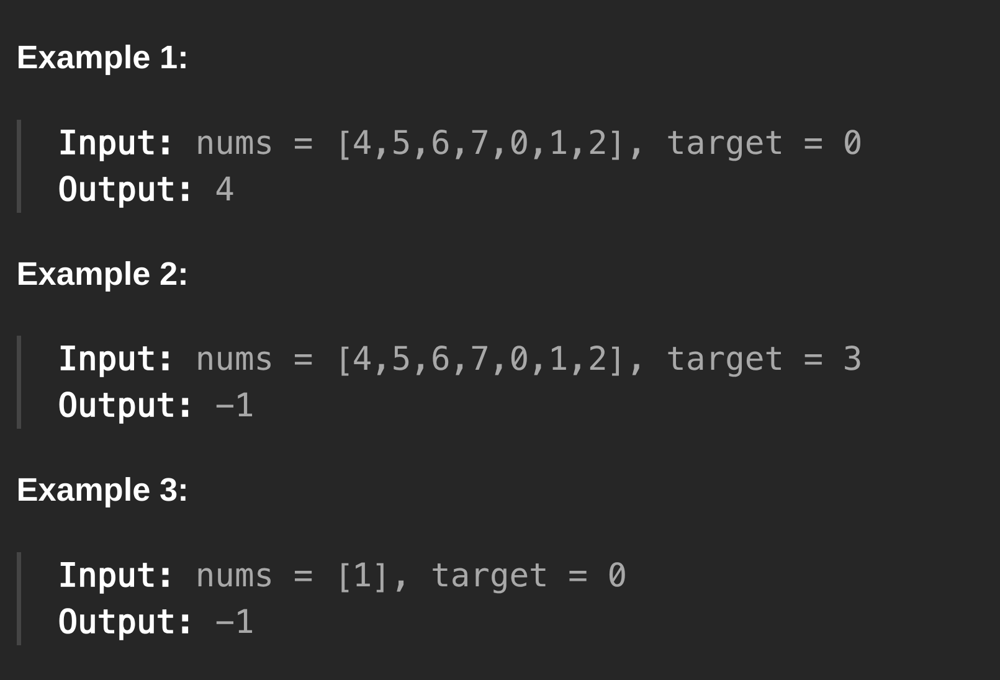

**Approach**

1. First we declare the left and right pointers for performing our binary search
2. Then within the while loop we have three things going on.
    1. If our current mid value == target: return the mid.
    2. If the current mid value is greater or equal than the left value. (This means the subarray from l -> m is sorted).
        1. If target is greater than the mid (value lies after mid) or left is greater than target (the rotation has made left greater so we can just skip to the right side to look for it). We take the right subarray here
        2. If target is less than mid (value lies in subarray from l -> m) or left is less than the target (The subarray maintains sorting despite rotation or not). We take the left subarray here
    3. If the current mid value is less than the left value (This means the subarray from l-> is not sorted ascending).
        1. If target is lesser than the mid (value lies before mid) or right is lesser than target (Rotation has made right subarray lesser than our target) We take the left subarray here
        2. If the target is greater than the mid (value lies after mid) or right is greater than target (Unaffected by rotation) The target probably lies in the right subarray here

Time: O(logn) Usual Binary Search time comp

Space: O(1) Not storing anything extra