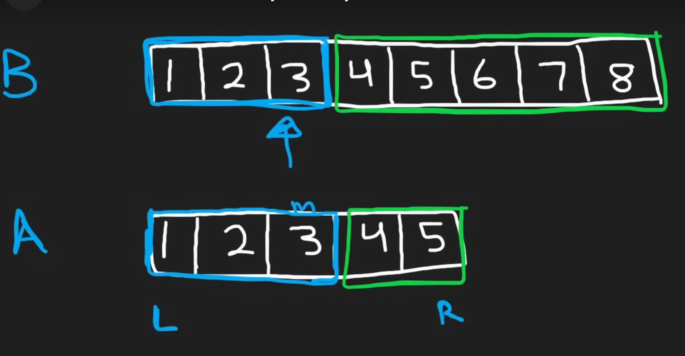

**Approach**

1. We want to find the median of the merged array formed by the two arrays.
2. We want to exploit the fact that both the arrays are already sorted. So we maintain a partition of both the arrays. We assume Array A is always shorter than Array B and if it isn't then we switch them so that it is
3. We do binary search on the A array so we declare l and r pointers and find the mid point.
4. The num of elements we need from the B array is half - mid - 2 (For 1-off index errors)

5. Let end of the A partition be Aleft and the element right after be Aright. Similarly for array B. Now there are three cases:
    1. Aleft <= Bright and Bleft <= Aright -> Find the median depending on if the total is odd or even. If odd we return the minimum(Aright, Bright) if odd (max(Aleft, Bleft) + min(Aright, Bright)) / 2
    2. Aleft > Bright -> We change our right subarray to start at mid - 1
    3. Bleft > Aright -> We change our left subarray to start at mid + 1

# To avoid edge cases during Aleft, Aright, Bleft, Bright. If mid < 0 we set Aleft to -inf and if mid + 1 > len(A) we set Aright to +inf. Similarly for B with the rest amount.

Time: O(log(min(n,m))) its minimum as we perform binary search on the shorter array always

Space: O(1) We don't store anything extra