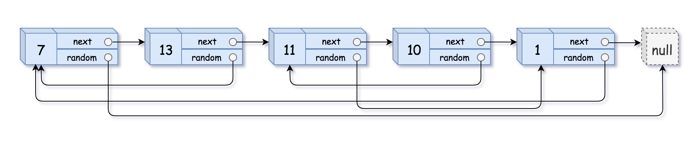

**Approach**

1. First we do one pass over the linked list and we create our Copy node with the value of the node. So we save our new node as the value and the key is the current node object. The reason we need to do this is because the random pointer might point to a node that doesn't exist yet if we go in any specific order.
2. In our second pass, we reset our cursor to the head of the list and then we retrieve the node we created into the hashmap to the corresponding current node. We then initialize its next and random pointer and then we move onto the next cur node.
3. At the end we return the value object stored to our corresponding head node. This will be the copied head of the list

Time: O(n) We pass through the entire list twice which is O(n+n) = O(n)

Space: O(n) We store a hashmap with each node in it.

