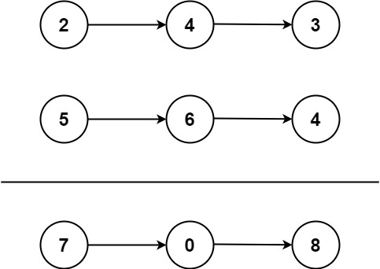

**Approach**

1. We declare a new linkedList first and then we initialize a pointer to the beginning of that list for traversing it while still having our head Node.
2. In our loop we check if either l1 or l2 or carry is true:
    1. If only carry is true, we add carry to a node only
    2. If either l1 or l2 is true as well, we add that to currentSum and declare the Node with value (currentSum)

3. At the end we return dummy.next since our first node is empty.

Time: O(max(n,m)) where n, m are the lengths of the two linked lists

Space: O(max(n,m)) where n, m are the lengths of the two linked lists