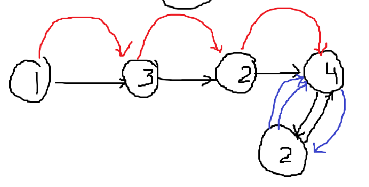

**Approach**

1. The solution uses Floyd's Turtle and Hare algorithm. We also use the values of the list itself as our pointers fast and slow. The fast pointer laps the slow pointer in the cycle formed when duplicates exist.
2. 
3. This is the example [1,3,4,2,2] after the slow pointer is placed in the correct position from the fast-slow process
4. At this stage, the blue pointer is our original and the red pointer is the second slow pointer at the start
5. They will equal at exactly the element 2 (proof left out but its simple and algebraic) and the program will return the correct duplicate element from the cycle.

Time: O(n) We go through the entire list once at

Space: O(1) We don't store anything extra