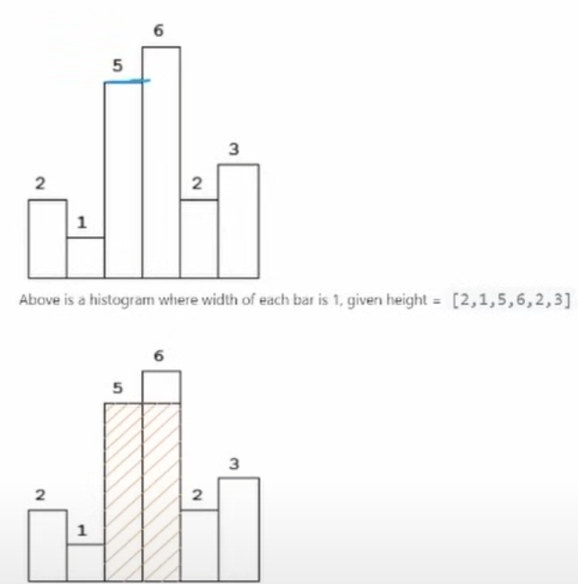
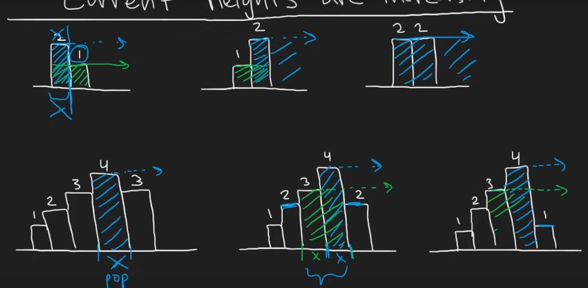

**Approach**

1. First let us notice the pattern in the solution
    1. When we have a lower length rectangle after a higher length rectangle, we cannot extend the area merge. -> We pop the greater one after computing the merged area so far
    2. When we have a higher or equal length rectangle after a rectangle, we can continue extending the area merge. -> We append to the stack to keep our merge going

2. So we initialize a maxArea which remembers the highest area we have seen so far.
3. We use a stack for the first in first out principle as we go through the rectangles this way in addition and deletion

Time: O(n) We parse through the entire input list once

Space: O(n) We may store the entire list in our stack in worst case